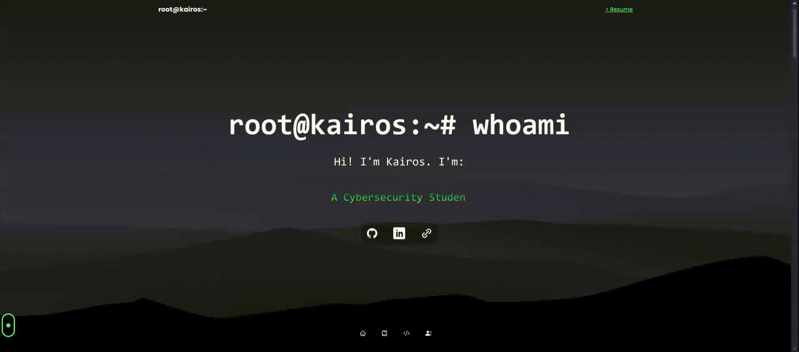

## Introduction

Over the past few days, I dived deeper into React and its extensive libraries to create my new and revamped [portfolio website](https://kairostay.com). In this entry, I'll share my experience and insights on how I brought my site to life!


## Understanding the Basics

To preface, React is a popular JavaScript library for building user interfaces. It has a component-based architecture, meaning that each "piece" of the UI is broken down into reusable components, such as the navigation bar, sections, footers and more.

This simplifies the development process and reduce the hardcoded-ness of the code.

## Hardcoded?

In my previous iteration of my portfolio website that was built with pure, vanilla HTML, CSS and JS, almost everything was hardcoded. If I had a major change to say, the navigation bar, I would have to go through every single page and change it.

This is not only tedious, but also inefficient. Additionally, as the content grew, the loading times soared, and the site became slower and slower.

React offered a solution to this problem. With its component-based architecture, I could create a single component, and reuse it across the entire site.

## Building the Site

To build my site, I used the following technologies:

- React
- iTyped
- Three.js
- React Three Fiber
- Framer Motion
- Tailwind CSS
- Bootstrap Icons

### Landing Page (Hero)

I started off with the landing page, or the hero section. I replicated this blog's landing page with a few tweaks. The background was set to 100% width and height, so that it would always fill the entire screen. It was a pretty interesting touch, and I really liked how it came out!

### iTyped

This simple library allowed me to create a typing effect for the site! It was pretty simple to use too. It simply required me to import the library, create the component, and a few lines of code to get it working.


### 3D Elements

To add flair to the site, I used some 3D elements with reference to others' code and models. Three.js and React Three Fiber allowed me to integrate the 3D graphics and make them interactive.


### Framer Motion

Framer Motion is a library that allows for animations and transitions. I used it to create the smooth transitions between sections.

If you were to look at the code, you'll see a bunch of `motion.div` and `motion.section` tags. These are the components that Framer Motion provides.

One small snippet would be as such:

```jsx
  <motion.div
    variants={fadeIn("", "spring", index * 0.5, 0.75)}
    className='Box2 p-5 rounded-3xl xs:w-[320px] w-full'
  >
      <div className='mt-7 flex flex-col justify-between items-center gap-1'>
        
        <div className='mt-3 flex-1 flex flex-col'>
          <p className='text-center text-white font-medium text-[16px]'>
            <span className='text-center blue-text-gradient'>{name}</span>
          </p>
        </div>

      </div>
    </div>
  </motion.div>
```

This added a fade in effect to the component, giving it a more polished look, which I've always been fond of when visiting other sites.

## Learning Points

This was a really interesting project to work on, and I learnt A LOT about React and its libraries. I gained a deeper understanding of not just React, but CSS too ~~which was a major pain~~!

To add on, as I dived in headfirst, I quickly realised that I overestimated my abilities. The initial desire to create a feature-rich site incorporating stuff like the Parallax scrolling effects, 3D elements, Framer motions and more was quickly replaced with a more realistic approach. 

I had to cut down on the features, and focus on the core components of the site. This was a great learning point, realising that I had to be more realistic and pragmatic in my approach to projects.

## Conclusion
Overall, I enjoyed building this site and I'm genuinely satisfied with the outcome. I'm looking forward to building more sites with React in the future, and hopefully implementing the features I missed out :")