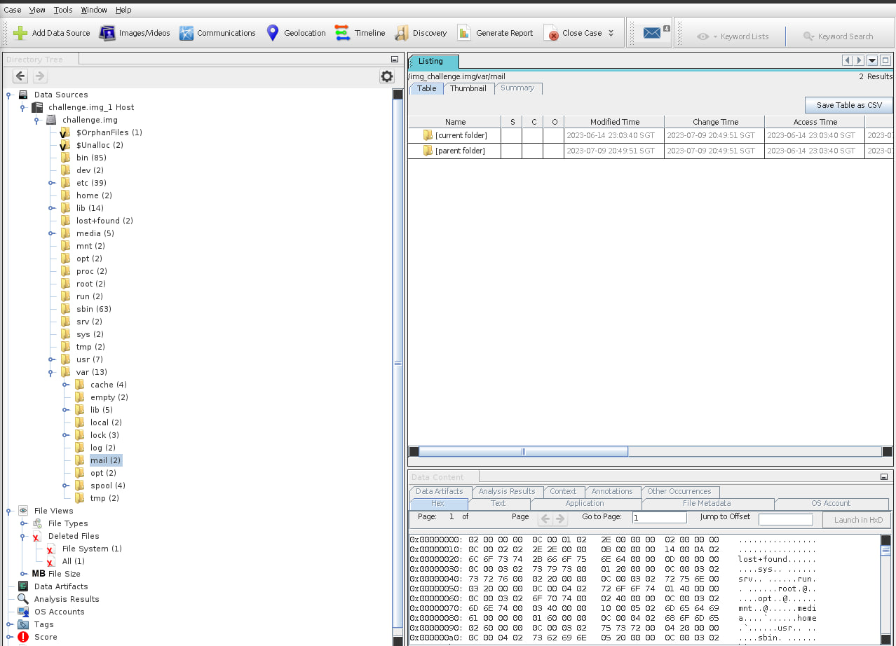
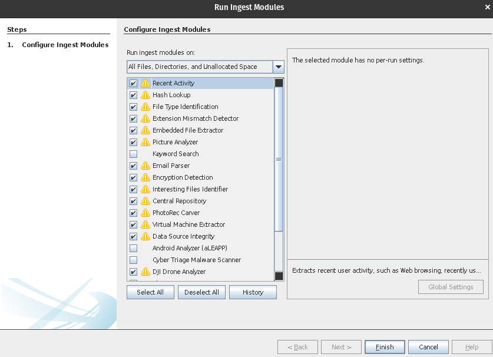
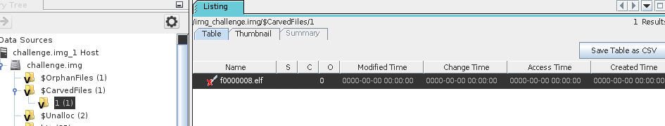

## Preface
Currently, I am playing under [404Unfound](https://404unfound.com/), a CTF team formed by my friends and I. More of my writeups can be viewed on the site too!

## TISC'23: Disk Archaeology

This was a forensic challenge in TISC, involving the analysis of a disk image. We are provided with a file called <a href="../img/TISC/challenge.tar.xz" download>challenge.tar.xz</a> which we had to find the hidden flag within the files. 

## The Challenge

```
Unknown to the world, the sinister organization PALINDROME has been crafting a 
catastrophic malware that threatens to plunge civilization into chaos. Your
mission, if you choose to accept it, is to infiltrate their secret digital 
lair, a disk image exfiltrated by our spies. This disk holds the key to 
unraveling their diabolical scheme and preventing the unleashing of a 
suspected destructive virus.

You will be provided with the following file:
- md5(challenge.tar.xz) = 80ff51568943a39de4975648e688d6a3

Notes:
- challenge.tar.xz decompresses into challenge.img
- FLAG FORMAT is TISC{<some text you have to find>}

ATTACHED FILES
challenge.tar.xz
```

Unzipping the zip file, we have a `challenge.img` file. Looking at the file type, we can see that it is a Linux filesystem.

```bash
kairos@pop-os:~$ file Downloads/challenge.img 
Downloads/challenge.img: Linux rev 1.0 ext4 filesystem data, UUID=2b4fee55-fd5f-483c-a85f-856944731f0f (extents) (64bit) (large files) (huge files)
```
## The Analysis

Knowing that this is a forensics challenge, I checked the strings of the file.  
```bash
kairos@pop-os:~$ strings -t d Downloads/challenge.img | grep -iE "tisc"

673796096 TISC{w4s_th3r3_s0m3th1ng_l3ft_%s}
```

While it looked like that was the flag, a quick search showed that `%s` is usually a placeholder for a string in languages like C and C++. 

Next, I mounted the file onto Autopsy. 



With many different directories and files that we had to potentially dig through, I decided to use Autopsy's tools to run ingest modules. 



I unchecked the modules that weren't available (due to compatibility issues with Linux) or irrelevant. These modules helped to carve suspicious files or potential things we could look into. 

After running the modules, I was able to retrieve a carved file, `f0000008.elf`.



The `.elf` file format is:
> Executable and Linkable Format, a common standard file format for executable files, object code, shared libraries, and core dumps. When you write C code and compile it, the resulting object files are often in ELF format.

Retrieving the file directly through Autopsy, I checked the file information.
```bash
kairos@pop-os:~$ file Downloads/f0000008.elf 
Downloads/f0000008.elf: ELF 64-bit LSB pie executable, x86-64, version 1 (SYSV), dynamically linked, interpreter /lib/ld-musl-x86_64.so.1, with debug_info, not stripped
```

I tried to analyse the strings, but did not get any useful information. Hence, I had to dig deeper. Initially, I tried to reverse the binary using `binary ninja`, but it led me rounds and rounds without any leads :"( and thus I had to find another solution.

## The Solution

The first step was to change the permissions of the file to allow it to be executed. 
```bash
kairos@pop-os:~$ chmod +x Downloads/f0000008.elf 
```

While it is possible to directly run the file, an error would be thrown if  there are missing dependencies (I did not encounter that error, but it was highlighted by a friend).

To check for missing dependencies, `ldd` (List Dynamic Dependencies) can be used to check the shared library dependencies of the file.
```bash
ldd Downloads/f0000008.elf 
	linux-vdso.so.1 (0x00007ffd7ef2e000)
	libc.musl-x86_64.so.1 => not found
```

To install the missing package,
```bash
sudo apt-get install musl
```

Next, we can directly run the file now. 
```bash
kairos@pop-os:~$ ./Downloads/f0000008.elf 
TISC{w4s_th3r3_s0m3th1ng_l3ft_ubrekeslydsqdpotohujsgpzqiojwzfq}
```

And we got the flag!