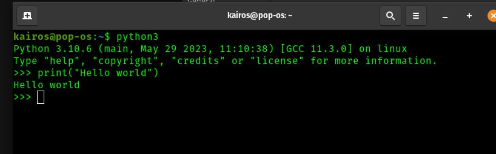
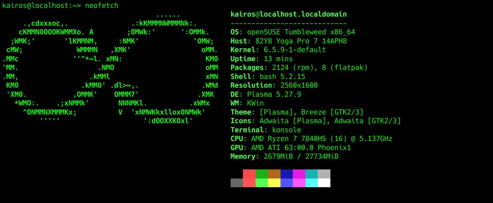
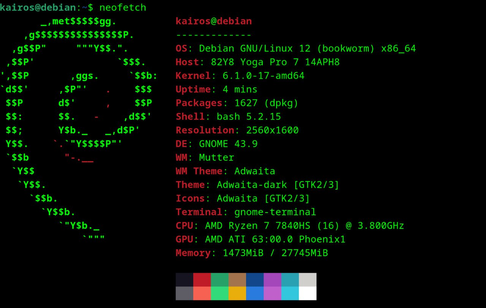
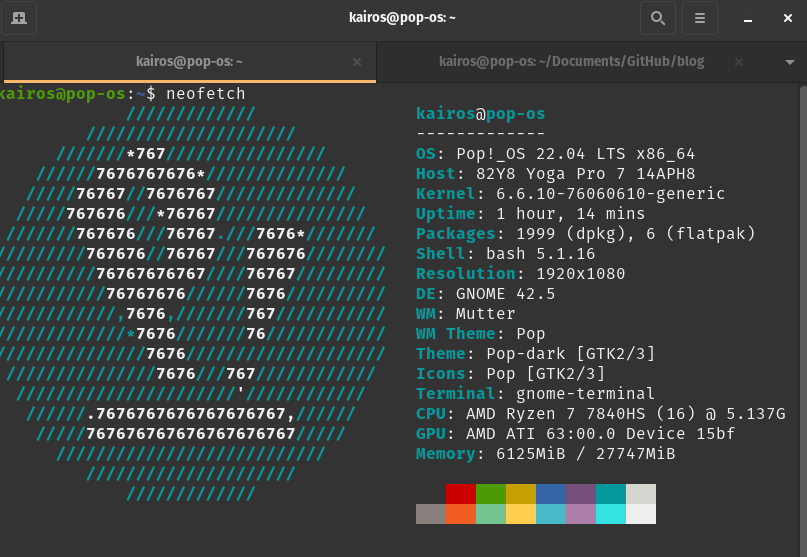
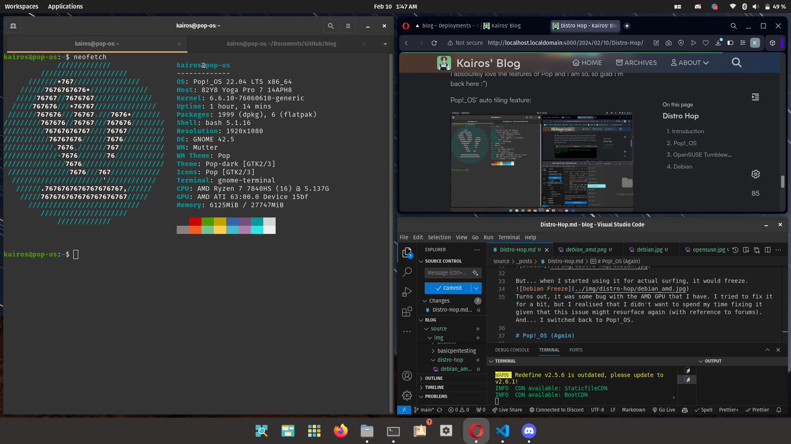

# Introduction
In 2023, I started to explore Linux (or GNU/Linux, if you will). Given that I started off with 'hacking', I used Kali Linux and Parrot Security. I realised the huge potential of Linux and started to explore other distro.

# Pop!_OS
My first ever host distro was Pop!_OS. I was introduced to Pop by a few friends and I was amazed by the simplicity - yet the power - of the distro. Pop!_OS is based on Ubuntu, so it was a good start for me. Unfortunately, this is the only screenshot I have of Pop!_OS:

I think Pop was the longest distro I've ever used; I used it from Jul 2023 to Nov 2023 - that's almost 5 months. After I switched to a new laptop, I needed a distro that could support more novel hardware, so I switched to OpenSUSE Tumbleweed.

# OpenSUSE Tumbleweed
OpenSUSE Tumbleweed is a distro that is rolling release, meaning that it is always up-to-date. I used it till Feb 2024. OpenSUSE was pretty nice, and I used KDE as my DE. 

It was really familiar, but its kryptonite was... constant breakage. I tried to update every day, and that came with a cost. It broke apps like Opera or VSCode, which was really a pain. I had to rollback a bunch of times or reinstall the apps (AND wiping their data; I guess it messed with the data files too). 

I was tired of the constant breakage, incompatibility with some apps, and I wasn't the biggest fan of it's package manager, Zypper. So I decided to switch to a stable distro and one that uses APT.

# Debian

I used Debian for a very, very short while. Less than a day. Less than an hour even. I was really excited to use Debian — don't get me wrong — and to be fair, it was really nice with the GNOME DE + some extensions. 

But... when I started using it for actual surfing, it would freeze.

Turns out, it was some bug with the AMD GPU that I have. I tried to fix it for a bit, but I realised that I didn't want to spend my time fixing it given that this issue might resurface again (with reference to forums). And... I switched back to Pop!_OS.

# Pop!_OS (Again)

I'm back to Pop!_OS, and I'm really satisfied with it. For the months that I've been away, as funny as it sounds, I missed it a lot. I even used VMware to run Pop!_OS on my OpenSUSE machine at one point 💀.

I absolutely love the features of Pop and I am so, so glad I'm back here :")

Pop!_OS' auto tiling feature:
