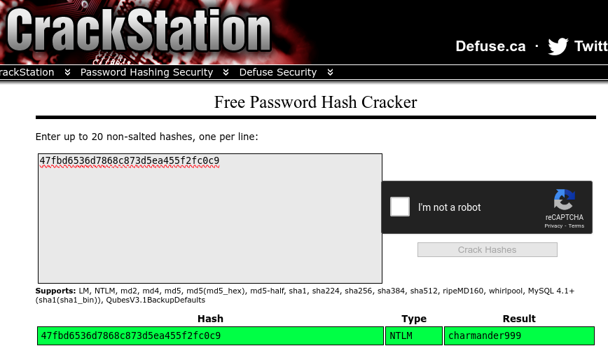
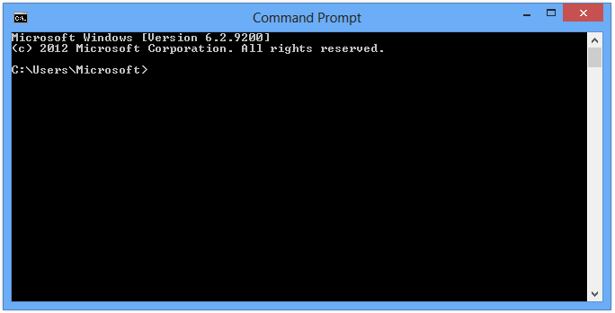
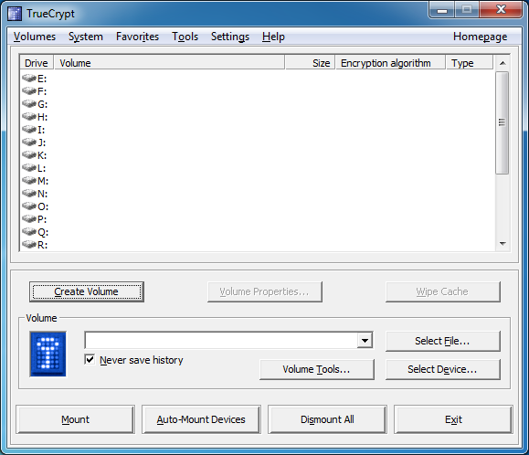

# Introduction
This is a writeup for the room [THM: Memory Forensics](https://tryhackme.com/room/memoryforensics) on [TryHackMe](https://tryhackme.com). It is a pretty good starting point for learning about memory forensics and using Volatility - a popular memory forensics framework. This was  my first time using Volatility, and I found it to be quite interesting!

## Installing Volatility
In the past, Volatility was preinstalled on Kali Linux. But it seems that its no longer the case :( There are distros like Deft and CAINE that have Volatility preinstalled, but here I'm simply using my host machine (Pop!_OS).

It can be installed on Linux systems using the following commands (copy and paste them into your terminal):

```bash
wget https://downloads.volatilityfoundation.org/releases/2.6/volatility_2.6_lin64_standalone.zip
unzip volatility_2.6_lin64_standalone.zip
sudo mv volatility_2.6_lin64_standalone/volatility_2.6_lin64_standalone /usr/local/bin/volatility
sudo chmod +xr /usr/local/bin/volatility
```

# Tasks

## Task 1 - Introduction

```
Perform memory forensics to find the flags. If you are having trouble, maybe check out the volatility room first.
Enjoy!

Please note: The size of the attached vmem file to download for each Task is large: 1.07 GB.
Here are some resources I used, check them out for more information:

Volatility: https://github.com/volatilityfoundation/volatility/
Volatility wiki: https://github.com/volatilityfoundation/volatility/wiki
Cheatsheet: https://book.hacktricks.xyz/generic-methodologies-and-resources/basic-forensic-methodology/memory-dump-analysis/volatility-examples
Room icon credit: https://book.cyberyozh.com/counter-forensics-anti-computer-forensics
```

No flag for this task :)

## Task 2 - Login

```
The forensic investigator on-site has performed the initial forensic analysis of John's computer and handed you the memory dump he generated on the computer. As the secondary forensic investigator, it is up to you to find all the required information in the memory dump.

What is John's password?
```

Here, we are given a memory dump file, `Snapshot6.vmem`. 

Usually, the first step is getting the profile of the memory dump. A profile is essentially the type of operating system and service pack that helps Volatility to interpret the memory dump. This can be done using the `imageinfo` command. 

```bash
kairos@pop-os:~/CTF/THM/MemoryForensics$ volatility imageinfo -f Snapshot6.vmem 
Volatility Foundation Volatility Framework 2.6
INFO    : volatility.debug    : Determining profile based on KDBG search...
          Suggested Profile(s) : Win7SP1x64, Win7SP0x64, Win2008R2SP0x64, Win2008R2SP1x64_23418, Win2008R2SP1x64, Win7SP1x64_23418
                     AS Layer1 : WindowsAMD64PagedMemory (Kernel AS)
                     AS Layer2 : FileAddressSpace (/home/kairos/CTF/THM/MemoryForensics/Snapshot6.vmem)
                      PAE type : No PAE
                           DTB : 0x187000L
                          KDBG : 0xf80002c4a0a0L
          Number of Processors : 1
     Image Type (Service Pack) : 1
                KPCR for CPU 0 : 0xfffff80002c4bd00L
             KUSER_SHARED_DATA : 0xfffff78000000000L
           Image date and time : 2020-12-27 06:20:05 UTC+0000
     Image local date and time : 2020-12-26 22:20:05 -0800
```

There are a few suggested profiles, but I'll go with the first one, `Win7SP1x64`.

Next, we need to figure out how to get the password. Looking at the manual page, there is an option for that:

```
hashdump       	Dumps passwords hashes (LM/NTLM) from memory
```

Using it:
```bash
kairos@pop-os:~/CTF/THM/MemoryForensics$ volatility -f Snapshot6.vmem --profile Win7SP1x64 hashdump
Volatility Foundation Volatility Framework 2.6
Administrator:500:aad3b435b51404eeaad3b435b51404ee:31d6cfe0d16ae931b73c59d7e0c089c0:::
Guest:501:aad3b435b51404eeaad3b435b51404ee:31d6cfe0d16ae931b73c59d7e0c089c0:::
John:1001:aad3b435b51404eeaad3b435b51404ee:47fbd6536d7868c873d5ea455f2fc0c9:::
HomeGroupUser$:1002:aad3b435b51404eeaad3b435b51404ee:91c34c06b7988e216c3bfeb9530cabfb:::
```

The hashed password is `47fbd6536d7868c873d5ea455f2fc0c9`. I used an [online hash cracker](crackstation.net) to get the password:



And we got the password! :D

## Task 3 - Analysis



```
On arrival a picture was taken of the suspect's machine, on it, you could see that John had a command prompt window open. The picture wasn't very clear, sadly, and you could not see what John was doing in the command prompt window.

To complete your forensic timeline, you should also have a look at what other information you can find, when was the last time John turned off his computer?

1. When was the machine last shutdown?
2. What did John write?

```

### Q1

Firstly, we need to find the profile of the memory dump. Similarly, we can use the `imageinfo` command:

```bash
kairos@pop-os:~/CTF/THM/MemoryForensics$ volatility imageinfo -f Snapshot19.vmem 
Volatility Foundation Volatility Framework 2.6
INFO    : volatility.debug    : Determining profile based on KDBG search...
          Suggested Profile(s) : Win7SP1x64, Win7SP0x64, Win2008R2SP0x64, Win2008R2SP1x64_23418, Win2008R2SP1x64, Win7SP1x64_23418
                     AS Layer1 : WindowsAMD64PagedMemory (Kernel AS)
                     AS Layer2 : FileAddressSpace (/home/kairos/CTF/THM/MemoryForensics/Snapshot19.vmem)
                      PAE type : No PAE
                           DTB : 0x187000L
                          KDBG : 0xf80002bfd0a0L
          Number of Processors : 1
     Image Type (Service Pack) : 1
                KPCR for CPU 0 : 0xfffff80002bfed00L
             KUSER_SHARED_DATA : 0xfffff78000000000L
           Image date and time : 2020-12-27 23:06:01 UTC+0000
     Image local date and time : 2020-12-28 00:06:01 +0100
```

Here, I'll use the first profile too. Then, let's find an option that can help us with finding the last shutdown time, with reference to the manual page:

```bash
kairos@pop-os:~/CTF/THM/MemoryForensics$ volatility -h | grep shutdown
Volatility Foundation Volatility Framework 2.6
		shutdowntime   	Print ShutdownTime of machine from registry
```

So, we can use the `shutdowntime` command:

```bash
kairos@pop-os:~/CTF/THM/MemoryForensics$ volatility -f Snapshot19.vmem --profile=Win7SP1x64 shutdowntime
Volatility Foundation Volatility Framework 2.6
Registry: SYSTEM
Key Path: ControlSet001\Control\Windows
Key Last updated: 2020-12-27 22:50:12 UTC+0000
Value Name: ShutdownTime
Value: 2020-12-27 22:50:12 UTC+0000
```

And we got the time of the last shutdown: `2020-12-27 22:50:12`.

### Q2

Here, we have to retrieve the command prompt history. There are two main options (last two) that we can use:

```bash
kairos@pop-os:~/CTF/THM/MemoryForensics$ volatility -h | grep command
Volatility Foundation Volatility Framework 2.6
		cmdline        	Display process command-line arguments
		cmdscan        	Extract command history by scanning for _COMMAND_HISTORY
		consoles       	Extract command history by scanning for _CONSOLE_INFORMATION
```

Both of them would work, but I'll use `cmdscan` since I'm simply getting the history rather than additional information:

```bash
kairos@pop-os:~/CTF/THM/MemoryForensics$  volatility -f Snapshot19.vmem --profile=Win7SP1x64 cmdscan
Volatility Foundation Volatility Framework 2.6
**************************************************
CommandProcess: conhost.exe Pid: 2488
CommandHistory: 0x21e9c0 Application: cmd.exe Flags: Allocated, Reset
CommandCount: 7 LastAdded: 6 LastDisplayed: 6
FirstCommand: 0 CommandCountMax: 50
ProcessHandle: 0x60
Cmd #0 @ 0x1fe3a0: cd /
Cmd #1 @ 0x1f78b0: echo THM{You_found_me} > test.txt
Cmd #2 @ 0x21dcf0: cls
Cmd #3 @ 0x1fe3c0: cd /Users
Cmd #4 @ 0x1fe3e0: cd /John
Cmd #5 @ 0x21db30: dir
Cmd #6 @ 0x1fe400: cd John
Cmd #15 @ 0x1e0158: "
Cmd #16 @ 0x21db30: dir
```

And we found what John wrote: `echo THM{You_found_me} > test.txt`!

## Task 4 - TrueCrypt



```
A common task of forensic investigators is looking for hidden partitions and encrypted files, as suspicion arose when TrueCrypt was found on the suspect's machine and an encrypted partition was found. The interrogation did not yield any success in getting the passphrase from the suspect, however, it may be present in the memory dump obtained from the suspect's computer.

What is the TrueCrypt passphrase?
```

Firstly, let's find the profile of the memory dump:

```bash
kairos@pop-os:~/CTF/THM/MemoryForensics$ volatility -f Snapshot14.vmem imageinfo
Volatility Foundation Volatility Framework 2.6
INFO    : volatility.debug    : Determining profile based on KDBG search...
          Suggested Profile(s) : Win7SP1x64, Win7SP0x64, Win2008R2SP0x64, Win2008R2SP1x64_23418, Win2008R2SP1x64, Win7SP1x64_23418
                     AS Layer1 : WindowsAMD64PagedMemory (Kernel AS)
                     AS Layer2 : FileAddressSpace (/home/kairos/CTF/THM/MemoryForensics/Snapshot14.vmem)
                      PAE type : No PAE
                           DTB : 0x187000L
                          KDBG : 0xf80002c4d0a0L
          Number of Processors : 1
     Image Type (Service Pack) : 1
                KPCR for CPU 0 : 0xfffff80002c4ed00L
             KUSER_SHARED_DATA : 0xfffff78000000000L
           Image date and time : 2020-12-27 13:41:31 UTC+0000
     Image local date and time : 2020-12-27 05:41:31 -0800
```

Next, we need to find what options Volatility has for TrueCrypt:

```bash
kairos@pop-os:~/CTF/THM/MemoryForensics$ volatility -h | grep -i truecrypt
Volatility Foundation Volatility Framework 2.6
		truecryptmaster	Recover TrueCrypt 7.1a Master Keys
		truecryptpassphrase	TrueCrypt Cached Passphrase Finder
		truecryptsummary	TrueCrypt Summary
```

We can use the `truecryptpassphrase` command to find the passphrase:

```bash
kairos@pop-os:~/CTF/THM/MemoryForensics$ volatility -f Snapshot14.vmem --profile Win7SP1x64 truecryptpassphrase
Volatility Foundation Volatility Framework 2.6
Found at 0xfffff8800512bee4 length 11: forgetmenot
```

And we found the passphrase: `forgetmenot`!

## Conclusion

That's it for this room! All in all, it was a pretty fun room for learning the basic commands for Volatility. :D