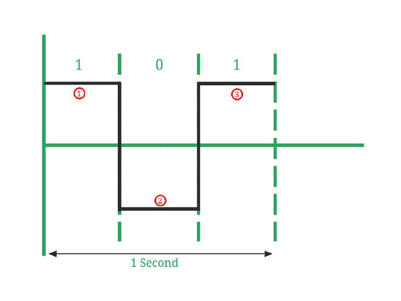
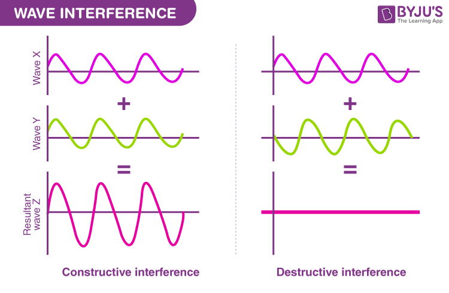
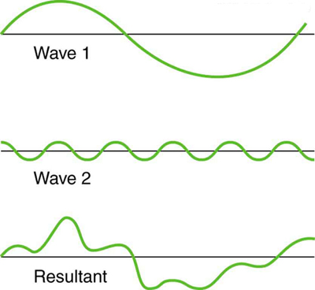
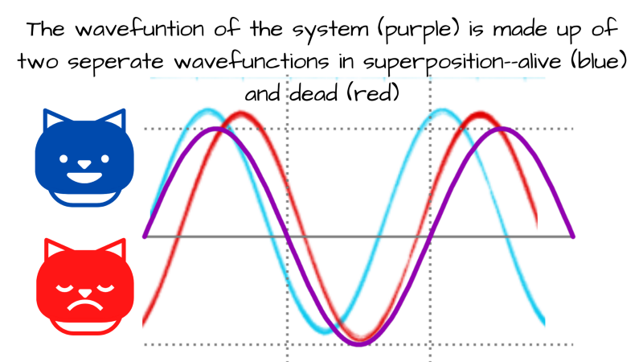
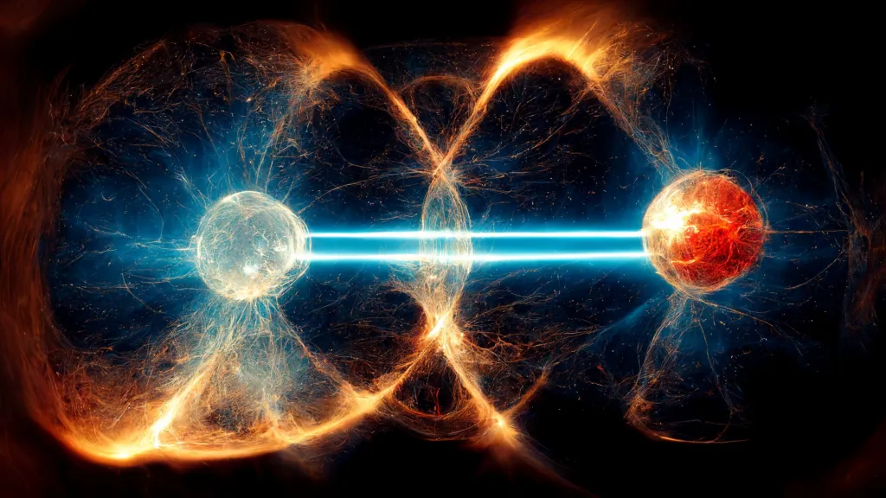

# Introduction

Quantum computing, as mentioned in my previous posts, has been a huge buzzword in the tech industry due to its potential to revolutionise some industries. But how exactly does it work? In this post, I will attempt to explain the physics behind quantum computing in a simple manner.

PS: This post is still a work in progress, I'll be adding more content soon!

# Classical vs Quantum Computing

Before we dive headfirst into the concepts, let us understand the properties of classical and quantum computing.

In classical computing, information is processed using bits. In quantum computing, information is processed using quantum bits, or qubits.

## Properties

**Bits**

- **States**: Can exist in one of two states: 0 or 1
- **Discrete**: Cannot be in between 0 and 1
- **Deterministic**: Given the same conditions and inputs, the outcome will always be the same
- **Measurement**: States are measured using physical systems that have two distinct states, like voltage or current, where 0 is represented by the absence of it, and 1 is represented by the presence.
  

**Qubits**

- **States**: Can exist in multiple states simultaneously, known as superposition.
  - Combination of both 0 and 1, denoted as `|0⟩` and `|1⟩`. The qubit can exist in a state `|ψ⟩` = `α|0⟩` + `β|1⟩`, where `|ψ⟩` is a wavefunction that represents the qubit state, and `α` and `β` are complex numbers.
- **Continuous**: Can be in between 0 and 1
- **Probabilistic**: Given the same conditions, the outcome will not always be the same. It is random, but there might be a higher probability of a certain outcome.
- **Measurement**: States are measured using quantum properties such as:
  - **Superconducting Qubits**: The direction of the current in a superconducting (zero resistance) loop
  - **Trapped Ion Qubits**: The energy levels of a trapped ion, manipulated using lasers
  - **Photonic Qubits**: The polarisation of a photon (horizontal or vertical)

# Quantum Mechanics

With basic understanding of the differences between classical and quantum computing, we can move on to the exact physics behind quantum computing.

## Wave-Particle Duality

Wave-particle duality is a concept that describes the behaviour of particles, such as electrons and photons. It states that these particles can behave like both a wave and a particle, depending on the situation (the context in which they are observed or measured).

**Wave**

- **Interference**: Waves can interfere with each other, either constructively (when the waves are in phase) or destructively (when the waves are out of phase).
  
- **Diffraction**: Waves can diffract around obstacles, causing them to spread out.
- **Superposition**: Waves can exist in multiple states simultaneously, known as superposition.
  
- **Wavelength and Frequency**: Waves have a wavelength and frequency, which are inversely proportional to each other.

**Particle**

- **Quantisation**: Particles can only exist in discrete energy levels
- **Localisation**: Particles can be localised to a specific position, meaning that they can be found at a specific point in space
- **Trajectory**: Particles have a trajectory, which can be determined using Newton's laws of motion

In essence, this duality allows quantum particles to behave like waves and particles at the same time. The dual nature is fundamental in quantum computing, allowing things like superposition to exist due to the wave-like properties, and the measurement of qubits due to the particle-like properties.

<!-- - **Superposition**: Existing in a combination of states associated with probability amplitudes in the wavefunction. On measurement, the wavefunction collapses into a single state, with a probability `P(x) = |ψ(x)|²` of being in the state `x`. -->

## Measurement and Quantum States

**Measurement**
I mentioned particle-like properties are used to measure qubits. But why? When a qubit is measured, it disrupts the quantum system, bringing about the collapse of the wavefunction. Hence, its state is determined and forced into either `|0⟩` or `|1⟩`.

Remember the Schrödinger's cat thought experiment? The cat inside a sealed box can be considered to be "both alive and dead", until the box is opened and the cat is observed.

This is similar to the collapse of the wavefunction, where the state is determined only when the box is opened.

**Quantum States**

Additionally, the final state of the qubit is probabilistic yet random. The state of a qubit is represented by the formula `α|0⟩` + `β|1⟩`.

Here, `α` and `β` are probability amplitudes. The probabilities must be a non-negative number, to ensure the probabilistic interpretation of the quantum state is valid. Thus, normalisation is required.

> The normalisation conditions require that the sum of probabilities of all possible outcomes is equal to 1.

For a single qubit, this means that `|α|² + |β|² = 1`. The probability of the qubit being in the state `|0⟩` or `|1⟩` is determined by the square of the magnitude of the complex number (which represents its state).

Lets say, we have a qubit in the state `|ψ⟩` = `α|0⟩` + `β|1⟩`. Since we know that the probability will be equal to 1, we can say that `|α|² + |β|² = 1`. We can assume that `|α|² = |β|² = 0.5`, and `α = β = 1/√2`. But wait. We found that the states of the qubits are probabilistic, so how can we assume that `|α|² = |β|² = 0.5` is true? This is where the Hadamard gate comes in. This will be touched on in the section under Quantum Gates and Circuits.

## Entanglement

But first, lets move on to another important concept in quantum computing: entanglement.

> Entanglement is a phenomenon in which the quantum states of two or more objects have to be described with reference to each other, even though the individual objects may be spatially separated.

This means that a change in the state of one qubit will affect the state of the other qubit, even if they are separated by a large distance. So, if one qubit is measured, its wavefunction collapses, and the wavefunction of the other qubit collapses instantaneously as well.

To look at this in a more mathematical manner, lets consider two qubits `|a⟩` and `|b⟩`. On its own, each qubit can be represented by the formula `α|0⟩ + β|1⟩`.

However, when the two qubits are entangled, the joint state of the system can be represented by the formula `α|00⟩ + β|01⟩ + γ|10⟩ + δ|11⟩`.

- `|xy⟩` represents the joint state of the two qubits, where `x` is the state of the first qubit, and `y` is the state of the second qubit.
- The probability amplitudes `α`, `β`, `γ`, and `δ` are normalised such that `|α|² + |β|² + |γ|² + |δ|² = 1`.

Essentially,the qubits are in a superposition of all the possible states, and the expression represents all the possible outcomes of the states of the qubit.

## Quantum Gates and Circuits
With the foundational concepts out of the way, we can now move on to the quantum gates and circuits.

### Quantum Gates
In classical computing, logic gates are used to manipulate bits. You might be familiar with the classical gates like `AND`, `OR`, and `NOT`. Similarly, quantum gates are used to manipulate qubits in quantum computing.

There are many different quantum gates: `Hadamard`, `Pauli-X, Y, Z`, `CNOT`, `Toffoli`, `SWAP` and many more. 

**Hadamard Gate**

