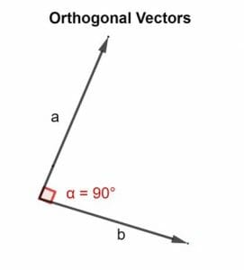

# Introduction

 Quantum computing, as mentioned in my previous posts, has been a huge buzzword in the tech industry due to its potential to revolutionise some industries. But how exactly does it work? Learning about quantum computing was rather daunting for me, with the complex physics concepts and mathematics involved, and so, so much information to digest.

In this post, I will attempt to explain the physics behind quantum computing in a simple manner.

PS: This post is still a work in progress, I'll be adding more content soon!

# Classical vs Quantum Computing

Before we dive headfirst into the concepts, let us understand the properties of classical and quantum computing.

In classical computing, information is processed using bits. In quantum computing, information is processed using quantum bits, or qubits.

## Properties

**Bits**

- **States**: Can exist in one of two states: 0 or 1
- **Discrete**: Cannot be in between 0 and 1
- **Deterministic**: Given the same conditions and inputs, the outcome will always be the same
- **Measurement**: States are measured using physical systems that have two distinct states, like voltage or current, where 0 is represented by the absence of it, and 1 is represented by the presence.
  

**Qubits**

- **States**: Can exist in multiple states simultaneously, known as superposition.
  - Combination of both 0 and 1, denoted as `|0⟩` and `|1⟩`. The qubit can exist in a state `|ψ⟩` = `α|0⟩` + `β|1⟩`, where `|ψ⟩` is a wavefunction that represents the qubit state, and `α` and `β` are complex numbers.
- **Continuous**: Can be in between 0 and 1
- **Probabilistic**: Given the same conditions, the outcome will not always be the same. It is random, but there might be a higher probability of a certain outcome.
- **Measurement**: States are measured using quantum properties such as:
  - **Superconducting Qubits**: The direction of the current in a superconducting (zero resistance) loop
  - **Trapped Ion Qubits**: The energy levels of a trapped ion, manipulated using lasers
  - **Photonic Qubits**: The polarisation of a photon (horizontal or vertical)

# Quantum Mechanics

Knowing the differences between classical and quantum computing, we can address the elephant in the room: quantum mechanics.

Quantum mechanics is a branch of physics that describes the behaviour of particles at the atomic and subatomic levels. It is the foundation of quantum computing, and is used to describe the behaviour of qubits.

## Planck's Constant and Wave-Particle Duality

### Planck's Constant
Planck's constant, is a fundamental physical constant in quantum mechanics. Denoted as `h` and having a value of approx. `6.626 x 10^-34 J*s`, it was used to explain energy quantisation, the idea that energy can only exist in discrete amounts. Planck proposed that energy is transferred in  discrete amounts, known as `quanta`.

Said relationship is represented by the formula `E = hf`, where: 
- `E` is the energy of the photon
- `h` is Planck's constant
- `f` is the frequency of the photon

This proves that energy of a quantum is proportional to its frequency. The higher the frequency, the higher the energy.

### Wave-Particle Duality
Building  on Planck's constant, we can move on to the concept of wave-particle duality.

Wave-particle duality is a concept that describes the behaviour of particles, such as electrons and photons. It states that these particles can behave like both a wave and a particle, depending on the situation (the context in which they are observed or measured).

**Wave**

- **Interference**: Waves can interfere with each other, either constructively (when the waves are in phase) or destructively (when the waves are out of phase).
  
- **Diffraction**: Waves can diffract around obstacles, causing them to spread out.
- **Superposition**: Waves can exist in multiple states simultaneously, known as superposition.
  
- **Wavelength and Frequency**: Waves have a wavelength and frequency, which are inversely proportional to each other.

**Particle**

- **Quantisation**: Particles can only exist in discrete energy levels
- **Localisation**: Particles can be localised to a specific position, meaning that they can be found at a specific point in space
- **Trajectory**: Particles have a trajectory, which can be determined using Newton's laws of motion

Looking back at the quanta relationship, `E = hf`, we can draw the link to wave-particle duality. The energy of the particle (`E`), has **particle-like properties**, while it's frequency (`f`), has **wave-like properties**. From this, we can see that the energy of the particle is  quantised into discrete units, while the frequency of the particle is continuous.

In essence, this allows quantum particles to behave like waves and particles at the same time. The dual nature is fundamental in quantum computing, allowing things like superposition to exist due to the wave-like properties, and the measurement of qubits due to the particle-like properties.

## Measurement and Quantum States

### Measurement

Earlier, I mentioned particle-like properties are used to measure qubits. But why? When a qubit is measured, it disrupts the quantum system, bringing about the collapse of the wavefunction. Hence, its state is determined and forced into either `|0⟩` or `|1⟩`.

Remember the Schrödinger's cat thought experiment? The cat inside a sealed box can be considered to be "both alive and dead", until the box is opened and the cat is observed.

This is similar to the collapse of the wavefunction, where the state is determined only when the box is opened.

### Quantum States

Additionally, the final state of the qubit is probabilistic yet random. The state of a qubit is represented by the formula `α|0⟩` + `β|1⟩`.

Here, `α` and `β` are probability amplitudes. The probabilities must be a non-negative number to ensure the probabilistic interpretation of the quantum state is valid. Thus, normalisation is required.

> The normalisation conditions require that the sum of probabilities of all possible outcomes is equal to 1.

For a single qubit, this means that `|α|² + |β|² = 1`. The probability of the qubit being in the state `|0⟩` or `|1⟩` is determined by the square of the magnitude of the complex number (which represents its state).

Lets say, we have a qubit in the state `|ψ⟩` = `α|0⟩` + `β|1⟩`. Since we know that the probability will be equal to 1, we can say that `|α|² + |β|² = 1`. We can assume that `|α|² = |β|² = 0.5`, and `α = β = 1/√2`. But wait. We found that the states of the qubits are probabilistic, so how can we assume that `|α|² = |β|² = 0.5` is true? This is where the Hadamard gate comes in. This will be touched on in the section under Quantum Gates and Circuits.

## Orthogonality

In quantum computing, the states of qubits are represented by vectors (represented by the formula `α|0⟩` + `β|1⟩`) in a vector space. States are said to be orthogonal if the angle between them is 90°, i.e. they are perpendicular to each other.

To make things easier to visualise, in a two-dimensional vector space, when we say that |0⟩ and |1⟩ are orthogonal, they are perpendicular to each other, like the x and y axes in a Cartesian plane.

In a more mathematical sense, the two vectors are orthogonal if their inner product is zero: `⟨a|b⟩` = 0.

However, there aren't only two-dimensional vector spaces. What about three-dimensional vector spaces? This is where the Bloch sphere comes in.

### Bloch Sphere

The Bloch sphere is a geometric representation to visualise the state of a qubit. It is based on the idea that any qubit state can be represented by a vector on the **surface** of a sphere.

In the Bloch sphere, the north pole corresponds to the state `|0⟩`, and the south pole corresponds to the state `|1⟩`. Hence, the states `|0⟩` and `|1⟩` are on opposite ends of the sphere.

You might think that they aren't orthogonal, since they are linear, and not perpendicular to each other. However, when we talk about them being perpendicular, we are referring to them in a cartesian plane.

The cartesian plane and Bloch sphere are two different representations of the similar concept. They differ in that (with reference to [this article](https://medium.com/quantum-untangled/visualizing-quantum-logic-gates-part-1-515bb7b58916)):

> The angle between the α-axis and the vector of the cartesian plane is always half of the angle between the z-axis and the vector of the Bloch sphere. In other words, if we increased the angle of the cartesian plane by 90º, the angle θ of the Bloch sphere increases by 180º.

Altogether, in the Bloch sphere, any pair of points that are on opposite ends of a diameter represent orthogonal states.

Orthogonality is important in quantum computing, allows us to distinguish between the states of qubits. This is because when we measure a qubit, it will collapse into either `|0⟩` or `|1⟩`. Therefore, we can distinguish between the two states during measurement.

## Entanglement

Lets move on to another important concept in quantum computing: entanglement.

> Entanglement is a phenomenon in which the quantum states of two or more objects have to be described with reference to each other, even though the individual objects may be spatially separated.

This means that a change in the state of one qubit will affect the state of the other qubit, even if they are separated by a large distance. As such, if one qubit is measured, its wavefunction collapses, and the wavefunction of the other qubit collapses instantaneously as well.

To look at this in a more mathematical manner, lets consider two qubits `|a⟩` and `|b⟩`. On its own, each qubit can be represented by the formula `α|0⟩ + β|1⟩`.

However, when the two qubits are entangled, the joint state of the system can be represented by the formula `α|00⟩ + β|01⟩ + γ|10⟩ + δ|11⟩`.

- `|xy⟩` represents the joint state of the two qubits, where `x` is the state of the first qubit, and `y` is the state of the second qubit.
- The probability amplitudes `α`, `β`, `γ`, and `δ` are normalised such that `|α|² + |β|² + |γ|² + |δ|² = 1`.

Essentially,the qubits are in a superposition of all the possible states, and the expression represents all the possible outcomes of the states of the qubit.

# Quantum Gates and Circuits

With the foundational concepts out of the way, we can now move on to the quantum gates and circuits.

**Quantum Gates**
In classical computing, logic gates are used to manipulate bits. You might be familiar with the classical gates like `AND`, `OR`, and `NOT`. Similarly, quantum gates are used to manipulate qubits in quantum computing.

There are many different quantum gates: `Hadamard`, `Pauli-X, Y, Z`, `CNOT`, `Toffoli`, `SWAP` and many more.

## Hadamard Gate

We briefly touched upon the Hadamard gate earlier. At its crux, it is used to create superposition. When applied to a qubit, it transforms the qubit from a classical state `|0⟩ or |1⟩` into an equal superposition of state, which basis is denoted as `|+⟩ or |−⟩` respectively.

> Basis: A set of states that can be used to represent any state within the vector space. Most commonly, the basis is represented by the states `|0⟩` and `|1⟩`. However, there are other bases that are frequently used, such as the `|+⟩` and `|−⟩` basis.

So, the states `|+⟩` and `|−⟩` are the superposition states of `|0⟩` and `|1⟩` respectively. They are represented by the formula:

- `|+⟩` = `1/√2` (`|0⟩` + `|1⟩`)
- `|−⟩` = `1/√2` (`|0⟩` - `|1⟩`).

  Do note that `|+⟩` and `|−⟩` can also be represented by `H|0⟩` and `H|1⟩` respectively, where `H` is the Hadamard gate.

As a result, the qubit is in a superposition, and the probability of it being in the state `|0⟩` or `|1⟩` is equal when measured is equal.

The way a qubit is transformed by the Hadamard gate is through these steps:

1. Initialise a qubit in the state `|0⟩`.
2. Apply the Hadamard gate to the qubit.
3. The qubit is now in the state `|+⟩`.

Thus in all, the Hadamard gate is used to create superposition with equal probability of the qubit being in the state `|0⟩` or `|1⟩`.

But before we move on, lets go even deeper. A Hadamard gate can be represented by a matrix:

$$
H = \\frac{1}{\\sqrt{2}} \\begin{bmatrix} 1 & 1 \\\\ 1 & -1 \\end{bmatrix}
$$

Some significant properties of the Hadamard gate are:

- **Normalisation**: The `1/√2` is used to normalise the matrix, ensuring that the sum of probabilities of all possible outcomes is equal to 1.
- **Matrix**: The matrix is used to represent the transformation of the qubit. The qubit is transformed by multiplying the matrix with the qubit.

  For example, if we were to apply the Hadamard gate to the state `|0⟩`, we would multiply the matrix with the state vector:

  $$
  H|0⟩ = \\frac{1}{\\sqrt{2}} \\begin{bmatrix} 1 & 1 \\\\ 1 & -1 \\end{bmatrix} \\begin{bmatrix} 1 \\\\ 0 \\end{bmatrix} = \\frac{1}{\\sqrt{2}} \\begin{bmatrix} 1 \\\\ 1 \\end{bmatrix} = \\frac{1}{\\sqrt{2}} (|0⟩ + |1⟩) = |+⟩
  $$

  Hence, we can see that the state `|0⟩` is transformed into the state `|+⟩`.

- **Equal Superposition**: The gate evenly distributes the probability amplitudes between the states `|0⟩` and `|1⟩`, creating equal superposition. The first column corresponds to the state `|0⟩`, and the second column corresponds to the state `|1⟩`.
- **Inverse**: The Hadamard gate is its own inverse, meaning that applying the Hadamard gate twice will return the qubit to its original state. This is because the matrix is symmetric, and the inverse of a symmetric matrix is itself.
  - This is rather intriguing, since it would seem that putting a qubit through the gate twice would randomise it twice. But it isn't the case, and the qubit returns to its original state. It seems like the qubit "remembers" its original state, and returns to it after being put through the gate twice.

In a nutshell, the Hadamard gate is used to create superposition with equal probability of the qubit being in the state `|0⟩` or `|1⟩`.

## Pauli-X, Y, Z Gates

The Pauli-X, Y and Z gates are different (but similar) gates that are also used to manipulate qubits. Each gate operates on a single qubit and introduces specific rotations in the quantum state space. 

In other words, they change the state of the qubit, but preserve the probability distribution of the qubit. With reference to the Bloch sphere

**Pauli-X Gate**

The Pauli-X gate is used to flip the state of the qubit. It is the quantum equivalent of the classical `NOT` gate. For example, if the qubit is in the state `|0⟩`, it will be flipped to the state `|1⟩`, and vice versa.