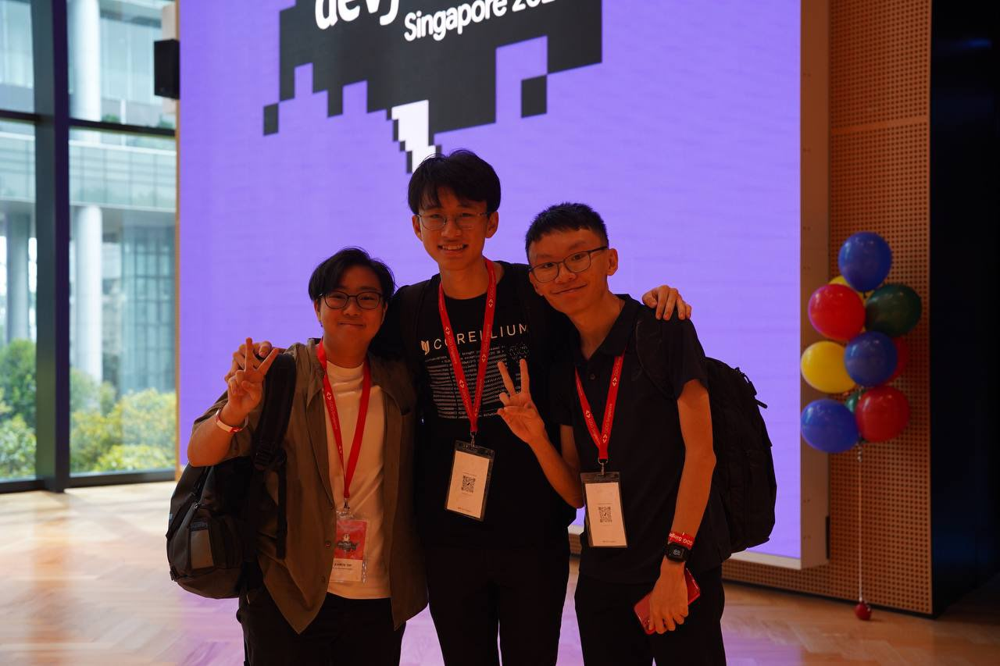
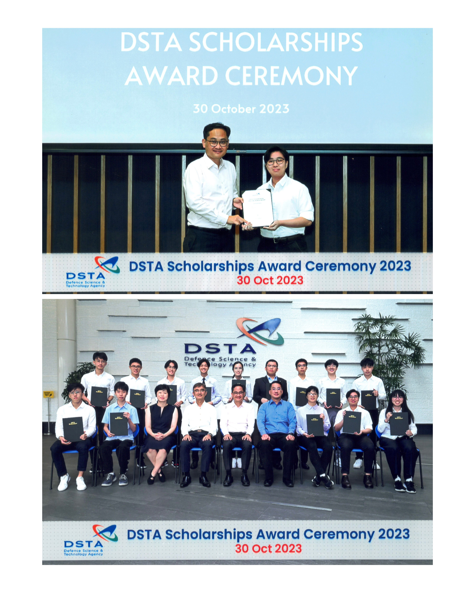

## Foreword

Trying something new here; I hope to truly use this blog as a progress tracker in my pursuit of knowledge in cybersec/tech. 

This post was inspired by my friend, [Bowen](https://hubowen.dev)!

## Wrapping Up 2023

2023 was an eventful year for me, to say the least. I achieved many milestones that — if you had told me about a year ago — I would have never believed you.

For starters, I was accepted into [Ngee Ann Polytechnic](https://www.np.edu.sg), pursuing a diploma in Cybersecurity & Digital Forensics. A year ago, I was uncertain if I could even clear my O Levels with a score good enough to enter this competitive course. 

I participated in various CTFs, finding my passion in topics like forensics, cryptography, osint and a bunch of other stuff. I found awesome friends along the way that share the same passion, and I love discussing random tech-related topics and other goofy stuff with them.

Here's a picture of two of my friends at DevFest 2023! Unfortunately, my other friends weren't there... and we don't have a picture together 🗿.

My biggest achievement was getting the [DSTA Polytechnic Digital Scholarship](https://www.dsta.gov.sg/join-us/student/scholarships-awards). To be frank, I was rather surprised when I received the acceptance email; I didn't think I would be able to get it. But I'm really grateful for the opportunity, and I hope to make the most out of it in my final year of poly (for the internship)!

There are many other things that I am beyond proud and grateful for, but I'll leave it at that. 

## Looking Forward

I'm quite excited for 2024. There are a bunch of things that I hope to achieve!

- Attend more CTFs, hopefully qualifying for the DSTA BrainHack 2024 Finals with my friends
- Improve my forensics and cryptography skills :O
- Work on more projects (Stay tuned!)

I might add more to this list or update the statuses of the things I've listed above, but for now, this is it!

Here's to a great 2024! 🎉